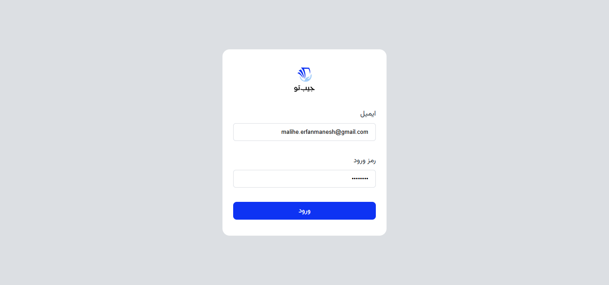
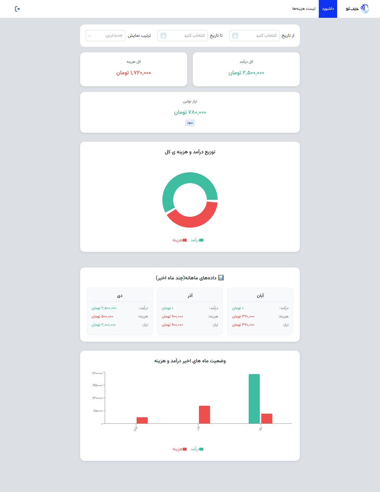
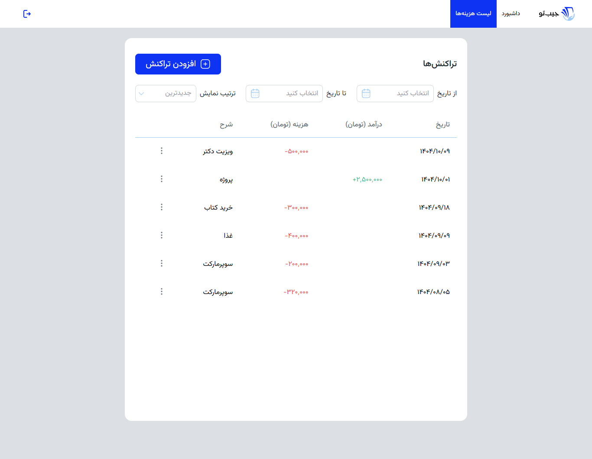
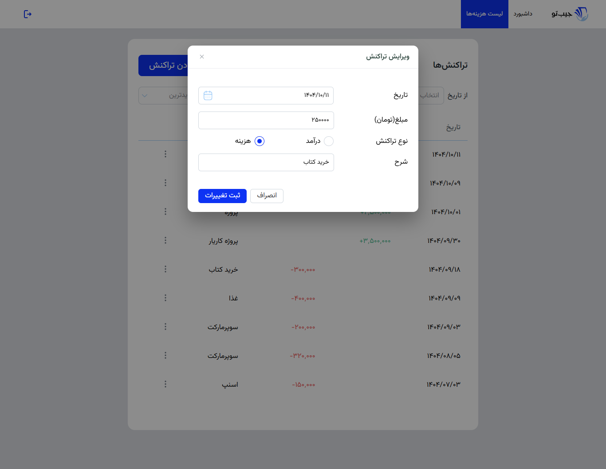
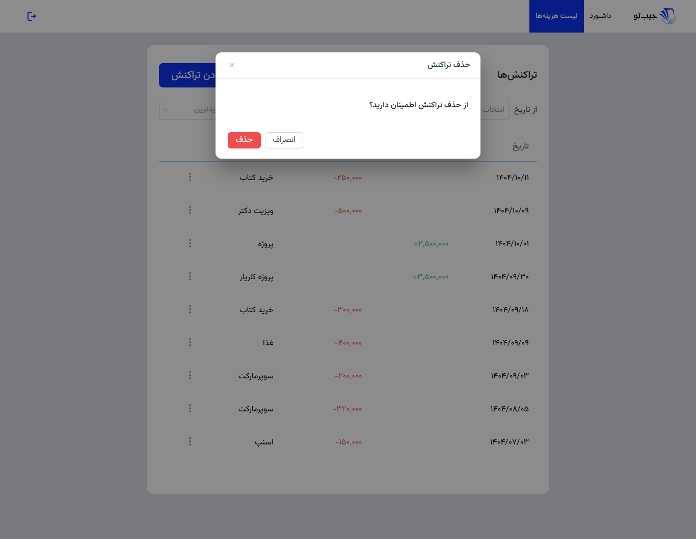
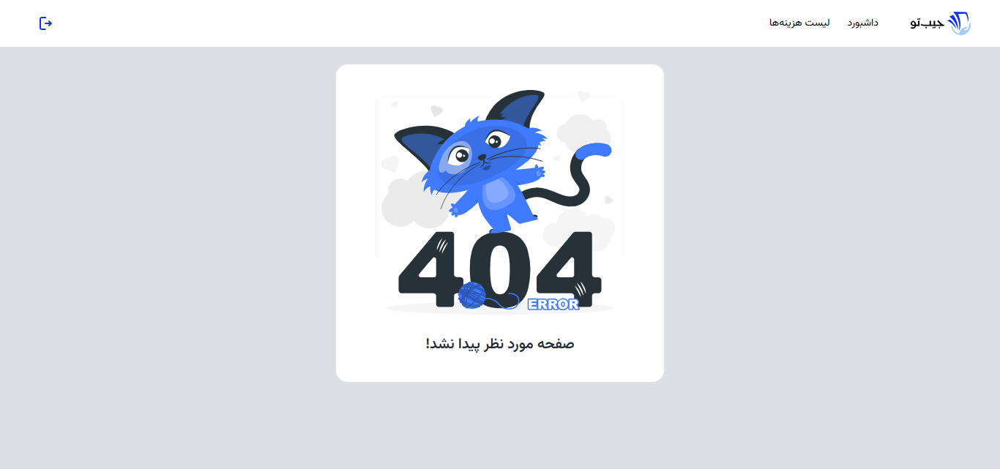

# پنل مدیریت هزینه (Expense Manager)

## 📌 هدف پروژه
یک سیستم مدیریت مالی شخصی و کاربردی برای ردیابی درآمدها و هزینه‌ها. این پروژه در قالب یک دوره کارآموزی ۱۲ هفته‌ای React.js توسعه یافته و تمام مراحل توسعه یک محصول واقعی از صفر تا صد را شبیه‌سازی می‌کند.

## ✨ ویژگی‌های اصلی
✅ ثبت و مدیریت تراکنش‌های مالی (درآمد/هزینه)

✅ داشبورد تعاملی با نمودارهای مختلف

✅ سیستم فیلتر و مرتب‌سازی پیشرفته

✅ احراز هویت و مسیرهای محافظت‌شده

✅ طراحی کاملاً واکنش‌گرا (موبایل و دسکتاپ)

✅ ارتباط با API واقعی (json-server)

✅ مدیریت State با Context API و Custom Hooks

## 🚀 نحوه اجرا

1. `npm install`
2. `npm run dev:all` (همزمان فرانت‌اند و سرور)
3. `npm run dev` فرانت‌اند (localhost:5173)
4. `npm run server` API سرور (localhost:3001)

## 🏗️ ساختار پروژه

- `src/pages/`: صفحات اصلی
- `src/components/`: کامپوننت‌های قابل استفاده مجدد
- `src/context/`: مدیریت state سراسری
- `src/hooks/`: هوک‌های اختصاصی
- `src/utils/`: ابزارهای کمکی

## 🗃️ ساختار داده‌ها

{
  "transactions": [
    {
      "id": "1",
      "date": "1403/09/15",
      "income": "500000",
      "outcome": "",
      "description": "حقوق ماهانه"
    }
  ],
  "users": [
    {
      "id": "1",
      "email": "user@example.com",
      "password": "password123"
    }
  ]
}

## 📸 اسکرین‌شات‌ها

### 🏠 صفحات اصلی

*صفحه ورود*

*داشبورد با نمودارهای تعاملی*

*لیست تراکنش‌ها*

### 🔧 عملیات CRUD

*افزودن تراکنش جدید*

*ویرایش تراکنش*

*حذف تراکنش*

### ⚠️ صفحات سیستمی

*صفحه ۴۰۴*

## 🔧 تکنولوژی‌ها

- React 19
- React Router(مسیریابی)
- Context API(مدیریت وضعیت)
- Recharts(نمودارها)
- Vite
- json-server
